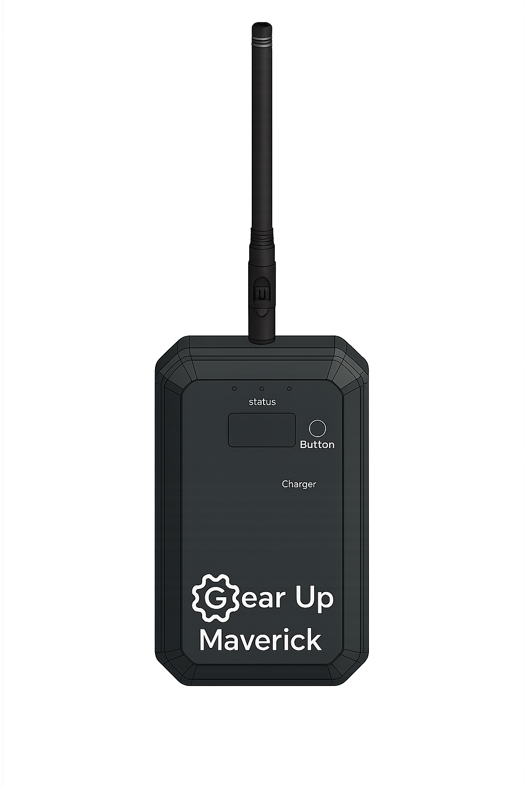

<h1>
  <picture>
    <source media="(prefers-color-scheme: dark)" srcset="datasheet/Gearup_White.png">
    <source media="(prefers-color-scheme: light)" srcset="datasheet/Gearup.png">
    
  </picture>
  Maverick
</h1>

This GitHub repository serves as a backup and documentation hub for the Maverick meshtastic device.

All official information and product details are available on our website: [Maverick Product page](https://takeyourgear.com/pages/products/maverick)

  <picture>
    
  </picture>

## Overview

The Maverick is now supported by for Meshtastic, with the target soon to be added to their main branches.
This repository exists to provide a secondary reference location — hosting documentation, pinout diagrams, and firmware resources — to ensure the information remains easily accessible.

## Pinout & Datasheet

The /datasheet folder contains the official datasheet and pinout diagrams for the AirBrain flight controller.

<div align="center" maxHeight="40">


</div>

<div align="center" maxHeight="40">


</div>

## 3D printed files
 
 The /3D folder contains step files for the 3D printed casing. 


## Firmware

The /firmware folder contains backup binaries and source files related to the Maverick target.

Please always use the official Maverick firmware provided by Meshtastic communities.

This repository is only for documentation and archival purposes.

Inside the firmware folder:

src/ – source files used for target creation

bin/ – precompiled binary files that can be flashed to the Maverick


## Bootloader

The /firmware folder contains backup bootloader for Maverick.

This can be flashed by connecting the EDC-06 connector to the SWD pins.

```cli
nrfjprog --recover
nrfjprog -f NRF52 --eraseall
nrfjprog --program s140v611.hex --family NRF52
nrfjprog -f NRF52 --program Maverick_bootloader-0.9.2-29-g6a9a6a3_s140_6.1.1.hex --chiperase --verify --reset --log
```

## Meshtastic recommended settings

```cli
meshtastic --set position.gps_update_interval 0
meshtastic --set position.position_broadcast_secs 10
meshtastic --set position.gps_attempt_time 1800
meshtastic --set position.position_flags 171
meshtastic --set position.gps_mode ENABLED
```

## Contact & More Info

<div align="center">

For additional details or support:

<info@takeyourgear.com>


[Website Gear Up](https://takeyourgear.com/)

</div>

